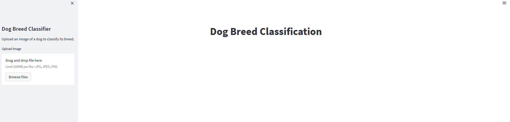
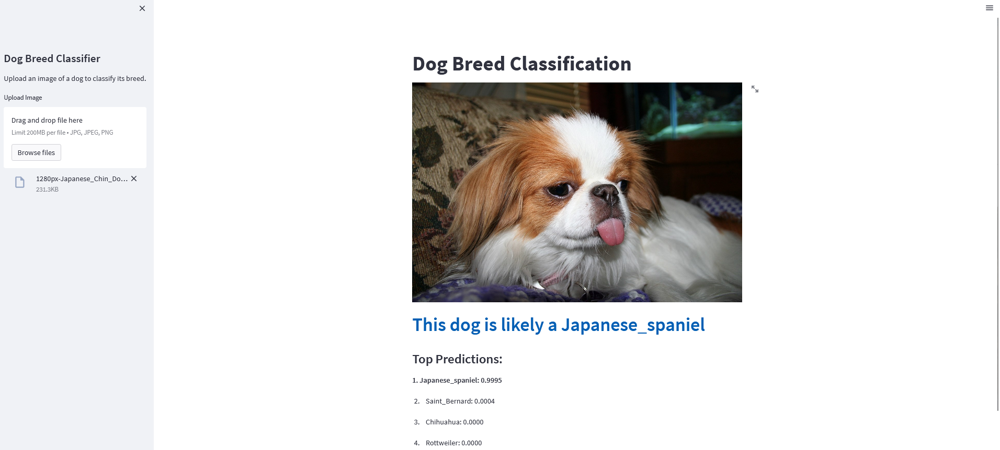

# Dog Breed Classification

This project is the second version. The first version was deployed using Gradio on the Huggingface platform. You can access the first version  [here](https://huggingface.co/spaces/Adonija/dog_category_prediction).

- [Overview](#overview)
- [Dataset](#dataset)
- [Model](#model)
- [Usage](#usage)
- [Results](#results)
- [Future Improvements](#future-improvements)
- [Contributing](#contributing)
- [License](#license)
- [Acknowledgements](#acknowledgements)
- [Contact](#contact)

## Overview

The goal of this project is to classify dog images into different categories. We have trained a deep learning model on four dog categories: "Japanese_spaniel", "Rottweiler", "French_bulldog", "Chihuahua", "Saint_Bernard", "Tibetan_terrier", "Eskimo_dog", "golden_retriever", "German_shepherd", "malinois". The model takes an input image and predicts the probability of the image belonging to each category. The category with the highest probability is considered the predicted dog category. We display the first four highest probability of the dog breeds.

## Dataset

To train the model, we used [Standford dog dataset](http://vision.stanford.edu/aditya86/ImageNetDogs/images.tar) containing dog images of 120 different breeds. This dataset was collected from multiple sources and meticulously labeled. To ensure the effectiveness of the model, we split the images into training and validation sets for both model training and evaluation purposes.

In addition to using the dataset, we employed data augmentation techniques. Data augmentation involves applying various transformations to the existing images to expand the training dataset and improve the model's generalization ability. These transformations may include random rotations, translations, flips, and changes in brightness and contrast.

By leveraging the Stanford Dogs dataset and implementing data augmentation techniques, we aimed to create a robust and accurate model for dog breed classification.

## Model

During the development of our dog breed classification model, we experimented with several architectures, including a standard CNN, VGG16, Inception, and Xception. After rigorous evaluation, we found that the Xception model outperformed the others on our dataset.

To train the Xception model, we utilized the training dataset and employed the categorical cross-entropy loss as our optimization objective. This loss function helped us minimize the discrepancy between the predicted probabilities and the true labels of the dog breeds. Additionally, we fine-tuned the hyperparameters of the model using Kerastuner, which allowed us to efficiently search and optimize the hyperparameter space.

By training the Xception model and fine-tuning its hyperparameters, we achieved satisfactory accuracy on the validation set. This indicates that the model has learned meaningful patterns and features from the training data, enabling it to accurately classify dog breeds.

## Usage

To test the deployed model, you can access it through the following link: [Dog Breed Classification App](https://adonija-zio-image-classification-appmain-grr3xk.streamlit.app/)

The model has been deployed using Streamlit Cloud, a platform for hosting and sharing Streamlit apps. With the deployed app, you can upload images of dogs and obtain predictions for their respective categories.

To run the app locally, you can follow these steps:

1. Clone the repository to your local machine:

<pre><code>
git clone https://github.com/Adonija-ZIO/Image_Classification.git
</code></pre>

2. Install the required dependencies:

<pre><code>
pip install -r app/requirements.txt
</code></pre>

Add your dog images to the appropriate category folders in the data directory. Ensure that the images are in the correct format (e.g., JPEG or PNG).

3; Run the classification script:
<pre><code>
python app/main.py
</code></pre>

<pre><code>
streamlit run app/main.py
</code></pre>

4. Access the app in your browser at http://localhost:8501.

In the input prompt, enter the path to your dog image.

The script will process the image and display the predicted probabilities for each category. The category with the highest probability is considered the predicted dog category.

Repeat the process for different dog images to test the accuracy of the model.

To ensure accurate predictions, it's important to note that the testing image must belong to the breeds that were included in the training dataset. The trained model has learned patterns and features specific to those breeds during the training process. Therefore, if the testing image is from a breed that was not part of the training dataset, the model may not be able to provide reliable predictions.

It's recommended to verify that the testing image corresponds to one of the known breeds included in the training dataset. This will help ensure that the model's predictions are based on the learned patterns for those specific breeds and can provide meaningful results.

Feel free to explore the app and test it with your own dog images. Enjoy!

## Future Improvements

Here are some potential areas for future improvements:

- Collect a larger and more diverse dataset to enhance the model's ability to generalize to unseen dog images.
- Experiment with different architectures and hyperparameters to further improve the model's accuracy.
- Implement data augmentation techniques to increase the dataset size and reduce overfitting.
- Deploy the model as an API or web application for easier usage and accessibility.

## Contributing

Contributions to this project are welcome. If you have any ideas, suggestions, or bug reports, please open an issue or submit a pull request.

## Acknowledgements

We would like to acknowledge the following resources that helped us in building this project:

* Dataset: Stanford Dog Images Dataset
* Deep Learning Framework: TensorFlow
* Image Processing Library: OpenCV
* Python Libraries: NumPy, Pandas, Matplotlib
* Deployment Platform: Streamlit Cloud

Without these invaluable resources and tools, this project would not have been possible. We are thankful for the contributions of the developers and researchers behind these projects, as they have greatly facilitated our work.

We also extend our appreciation to the open-source community for their continuous efforts in advancing the field of machine learning and providing accessible resources for developers and researchers worldwide.

Contact

If you have any questions or inquiries about this project, you can reach us at [email](adonijafirst@yahoo.fr)

Feel free to customize this README file according to your project's specific details and requirements. Good luck with your dog breeds classification project!

Project Author

This project was developed by **Adonija ZIO**.